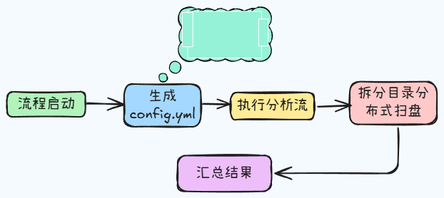

# dirScan

用于集群目录的扫盘, 基于c++17的systemfile库，遍历文件夹，生成详细文件列表及无权限文件及目录列表， 其中详细文件列表分为路径、文件大小、文件创建时距离现在的秒数、文件创建时距离现在的天数这几列， 流程以snakemake作为串写，先通过userDirScan扫出详情表， 后续再通过pl/py脚本进行统计分类等

# 流程图



# 使用方法

流程示例目录： /public/work/Personal/fuxiangke/dirScan

执行以下脚本完成扫盘

```shell
#! /usr/bin/bash
source /etc/profile
source /public/home/fuxiangke/.bashrc
pipe_path=/public/work/Personal/fuxiangke/pipeline/userDirScanner
/public/work/Personal/fuxiangke/software/Miniconda3/envs/snakemake_env/bin/python $pipe_path/script/config_generator.py -l $pipe_path/dir.lst -o $pipe_path/config.yml
cd /public/work/Personal/fuxiangke/dirScan || exit 1 
/public/work/Personal/fuxiangke/software/Miniconda3/envs/snakemake_env/bin/snakemake --keep-going --profile /public/home/fuxiangke/.config/snakemake/slurm  -s /public/work/Personal/fuxiangke/pipeline/userDirScanner/userDirScanner.smk
```

目录结构

2026-06-07
├── bijinpeng
│   ├── bam.tsv
│   ├── fastq.tsv
│   ├── merge.ds.tsv
│   ├── report.md
│   ├── report.tsv
│   └── vcf.tsv
├── chenzhiqiang
│   ├── bam.tsv
│   ├── fastq.tsv
│   ├── merge.ds.tsv
│   ├── report.md
│   ├── report.tsv
│   └── vcf.tsv
├── datatransfer
│   ├── bam.tsv
│   ├── fastq.tsv
│   ├── merge.ds.tsv
│   ├── report.md
│   ├── report.tsv
│   └── vcf.tsv
